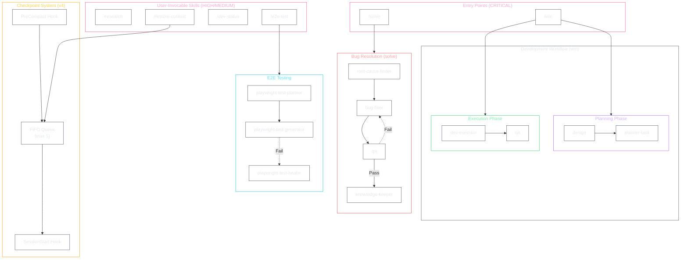

# Skills & Agents Architecture

> Claude Code 커스텀 워크플로우 시스템의 전체 아키텍처 문서
>
> **Version**: 2.0.0 | **Updated**: 2026-01-25

---

## 1. System Overview

이 시스템은 Claude Code의 확장 기능으로, 복잡한 소프트웨어 개발 워크플로우를 자동화합니다.

### Primary Entry Point

| Entry Point | Command | Priority | Description |
|-------------|---------|----------|-------------|
| **wm** | `/wm` | CRITICAL | 통합 워크플로우 매니저 (권장) |
| solve | `/solve` | CRITICAL | 문제 해결 전용 |
| planner | `/planner` | HIGH | Legacy (wm 권장) |

### Design Principles

- **단일 진입점**: `/wm` 스킬이 모든 개발 워크플로우의 오케스트레이터 역할
- **9 Type 분류**: NEW_DEV, MOD, BUG_FIX(3), INQUIRY, REPORT, CLEANUP, MULTI_INTENT, RESTORATION
- **위임 패턴**: Main Thread는 편집하지 않고, Task tool로 서브에이전트에 위임
- **품질 게이트**: 각 단계마다 필수 검증 (planner-task self-validation, qa)
- **TDD 워크플로우**: RED → GREEN → REFACTOR 사이클 준수
- **체크포인트 시스템**: v4 FIFO로 context compression 후 복원 지원

---

## 2. Quick Navigation

| Module | File | Description |
|--------|------|-------------|
| **Skills** | [SKILLS.md](../architecture/SKILLS.md) | 15개 스킬 전체 카탈로그 |
| **Agents** | [AGENTS.md](../architecture/AGENTS.md) | 11개 에이전트 전체 카탈로그 |
| **Hooks** | [HOOKS.md](../architecture/HOOKS.md) | 훅 시스템 (7 configs, 9 scripts) |
| **Workflows** | [WORKFLOWS.md](../architecture/WORKFLOWS.md) | wm, solve, Explore 워크플로우 |
| **Checkpoint** | [CHECKPOINT-SYSTEM.md](../architecture/CHECKPOINT-SYSTEM.md) | v4 FIFO 체크포인트 시스템 |

---

## 3. Architecture Diagram



---

## 4. Skills Summary

**Total: 15 skills** | [Full catalog →](../architecture/SKILLS.md)

### By Priority

| Priority | Count | Skills |
|----------|-------|--------|
| **CRITICAL** | 2 | wm, solve |
| **HIGH** | 6 | research, codebase-explorer, code-quality, e2e-test, clarification-protocol |
| **MEDIUM** | 6 | worktree-manager, restore-context, skill-creator, dev-status, plan-cleanup, quickstart, codex-review |
| **LOW** | 1 | best-practices (rules-only) |

### User-Invocable Commands

| Command | Skill | Description |
|---------|-------|-------------|
| `/wm` | wm | 통합 워크플로우 매니저 |
| `/solve` | solve | 문제 해결 프로세스 |
| `/research` | research | 심층 리서치 |
| `/codebase-explorer` | codebase-explorer | LSP 탐색 |
| `/e2e-test` | e2e-test | E2E 테스트 |
| `/worktree-manager` | worktree-manager | Worktree 관리 |
| `/restore-context` | restore-context | 컨텍스트 복원 |
| `/dev-status` | dev-status | 진행 상황 |

---

## 5. Agents Summary

**Total: 11 agents** (10 custom + 1 built-in) | [Full catalog →](../architecture/AGENTS.md)

### By Category

| Category | Agents |
|----------|--------|
| **Core Development** | design, planner-task, dev-executor, qa |
| **Bug Resolution** | root-cause-finder, bug-fixer, knowledge-keeper |
| **E2E Testing** | playwright-test-planner, playwright-test-generator, playwright-test-healer |
| **Analysis** | Explore (built-in) |

### Agent Chain (Development)

```
wm skill
  ├── design (opus)
  └── planner-task (sonnet)
  └── dev-executor (sonnet, background)
        └── qa (sonnet, background)
```

---

## 6. Hooks System

**7 configs, 9 scripts, 4 config files** | [Full documentation →](../architecture/HOOKS.md)

### Hook Events

| Event | Hook | Description |
|-------|------|-------------|
| PreToolUse | sensitive-file-guard | 민감 파일 수정 차단 |
| PostToolUse | plan-worktree-hook | 계획 파일 시 worktree 생성 |
| PostToolUse | quality-check | TypeScript 품질 검사 |
| UserPromptSubmit | decision-context | 결정 컨텍스트 주입 |
| SubagentStop | subagent-monitor | 에이전트 완료 모니터링 |
| PreCompact | precompact-save-state | 체크포인트 저장 |
| SessionStart | session-start-restore-hint | 복원 안내 표시 |

---

## 7. Checkpoint System

**v4 FIFO Architecture** | [Full documentation →](../architecture/CHECKPOINT-SYSTEM.md)

### Key Features

| Feature | Description |
|---------|-------------|
| FIFO Queue | 최대 5개 체크포인트 유지 |
| Slot Access | `--slot N` (1=최근) |
| Auto-migration | v1/v3 → v4 자동 변환 |
| Agent Resume | `last_agent_id`로 에이전트 재개 |

### Checkpoint Flow

```
Context Compression → PreCompact Hook → Save Checkpoint
                                              ↓
New Session → SessionStart Hook → Display Options
                                              ↓
/restore-context → Select Checkpoint → Resume Workflow
```

---

## 8. Workflow Types (wm)

**9 Types** | [Full documentation →](../architecture/WORKFLOWS.md)

| Type | Process | Worktree | Description |
|------|---------|----------|-------------|
| NEW_DEVELOPMENT | development-process.md | Yes | 새 기능 개발 |
| MODIFICATION | development-process.md | Yes | 기존 기능 수정 |
| BUG_FIX (Simple) | bug-fix-simple.md | No | 단순 버그 |
| BUG_FIX (Complex) | bug-fix-complex.md | Yes | 복잡한 버그 |
| BUG_FIX (E2E) | bug-fix-e2e.md | No | UI/E2E 버그 |
| INQUIRY | inquiry.md | No | 분석/조사 |
| REPORT | report.md | No | 상태 보고 |
| CLEANUP | cleanup.md | No | 파일 정리 |
| MULTI_INTENT | multi-intent.md | Depends | 복합 요청 |
| RESTORATION | (checkpoint) | No | 상태 복원 |

---

## 9. Quality Gates

| Gate | Agent | Timing | Failure Action |
|------|-------|--------|----------------|
| Task Validation | planner-task (Self-Validation) | After task breakdown | Regenerate tasks |
| QA Verification | qa | After dev-executor | Fix & re-test |

---

## 10. Directory Structure

```
.claude/
├── architecture/                    # 상세 모듈 문서
│   ├── SKILLS.md                   # 22개 스킬 카탈로그
│   ├── AGENTS.md                   # 13개 에이전트 카탈로그
│   ├── HOOKS.md                    # 훅 시스템
│   ├── WORKFLOWS.md                # 워크플로우 상세
│   └── CHECKPOINT-SYSTEM.md        # 체크포인트 시스템
│
├── skills/                          # 스킬 정의
│   ├── ARCHITECTURE.md              # 이 문서
│   ├── wm/                          # 통합 워크플로우 매니저
│   │   ├── SKILL.md
│   │   └── rules/                   # 프로세스 및 컴포넌트
│   ├── solve/                       # 문제 해결
│   ├── quickstart/                  # 자동 설정
│   │   └── rules/registries/        # 소스 레지스트리 (YAML)
│   └── ...                          # 기타 스킬
│
├── agents/                          # 에이전트 정의
│   ├── design.md
│   ├── planner-task.md
│   ├── dev-executor.md
│   ├── qa.md
│   └── ...
│
├── hooks/                           # 훅 스크립트
│   ├── hook-utils.sh               # 공유 유틸리티
│   ├── sensitive-file-guard.sh
│   ├── quality-check.sh
│   └── ...
│
├── plans/                           # 계획 문서
│   ├── {feature-name}.md           # PRD
│   ├── {feature-name}-DESIGN.md    # 설계
│   ├── {feature-name}-TASKS-*.md   # 태스크
│   └── complete/                    # 완료된 계획
│
└── workflow-checkpoint.json         # 체크포인트 (v4 FIFO)
```

---

## 11. Key Rules

### Main Context Restrictions

| Forbidden | Reason |
|-----------|--------|
| `Edit` | 에이전트를 통해야 함 |
| `Write` (code) | 에이전트를 통해야 함 |
| Direct `Glob`/`Grep` | Explore agent 사용 |

**Allowed**: `Read`, `Task`, `AskUserQuestion`, `Bash` (읽기 전용)

### Background Agent Requirements

| Agent | Duration | `run_in_background` |
|-------|----------|---------------------|
| design | 2-5분 | Required |
| planner-task | 2-10분 | Required |
| dev-executor | 5-30분 | Required |
| qa | 3-10분 | Required |

---

## Version History

| Version | Date | Changes |
|---------|------|---------|
| 2.0.0 | 2026-01-25 | Modular architecture, wm as primary entry, v4 checkpoint, hooks documentation |
| 1.0.2 | 2026-01-23 | BugWorkflow에 qa 추가 |
| 1.0.1 | 2026-01-23 | Mermaid 다이어그램 스타일 업데이트 |
| 1.0.0 | 2026-01-23 | 초기 아키텍처 문서 작성 |

---

## Source of Truth

| Component | Registry File |
|-----------|---------------|
| Skills | `.claude/skills/wm-setup/rules/registries/skills.yaml` |
| Agents | `.claude/skills/wm-setup/rules/registries/agents.yaml` |
| Hooks | `.claude/skills/wm-setup/rules/registries/hooks.yaml` |
