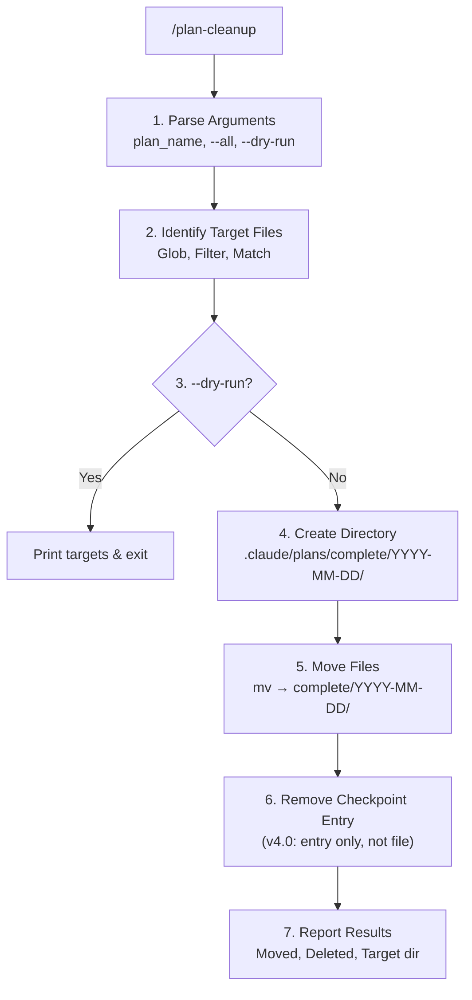

# Cleanup Logic

계획 정리 상세 로직입니다.

## File Pattern Matching

### 이동 대상

| Pattern | Description | Example |
|---------|-------------|---------|
| `PLAN_*.md` | PRD 계획 문서 | `PLAN_postgresql-rbac.md` |
| `DESIGN_*.md` | 설계 문서 | `DESIGN_postgresql-rbac.md` |
| `TASKS_*.md` | 태스크 문서 | `TASKS_postgresql-rbac.md` |
| `<random-name>.md` | Plan Mode 계획 | `zazzy-herding-biscuit.md` |

### 체크포인트 처리 (v4.0 multi-checkpoint)

| File | Action | Description |
|------|--------|-------------|
| `.claude/workflow-checkpoint.json` | **엔트리 제거** | 해당 plan의 체크포인트 엔트리만 제거 |

**⚠️ 중요**: 파일 전체 삭제 금지! 다른 workflow의 체크포인트가 손실됩니다.

### 제외 대상

```
.claude/plans/complete/**/*  # 이미 완료된 계획
```

## Execution Flow



## Plan Name Matching

특정 plan_name이 주어진 경우:

```bash
# Input: plan_name = "snazzy-enchanting-brook"
# Matches (TO-BE 플랫 구조):
#   - snazzy-enchanting-brook.md           (PRD)
#   - snazzy-enchanting-brook-DESIGN.md    (설계 문서)
#   - snazzy-enchanting-brook-TASKS-PHASE-1.md (PHASE 1 태스크)
#   - snazzy-enchanting-brook-TASKS-PHASE-2.md (PHASE 2 태스크)
```

### Matching Algorithm

```python
def match_plan_files(plan_name: str) -> List[str]:
    """
    계획 이름과 관련된 모든 파일을 찾습니다.
    TO-BE 플랫 구조 기준.
    """
    base_patterns = [
        # TO-BE 플랫 구조 패턴
        f"{plan_name}.md",           # PRD (메인 계획 파일)
        f"{plan_name}-DESIGN.md",    # 설계 문서 (통합)
    ]

    # TASKS-PHASE-*.md 파일 검색 (glob 패턴)
    glob_patterns = [
        f".claude/plans/{plan_name}-TASKS-PHASE-*.md",
    ]

    matched = []
    for pattern in base_patterns:
        path = f".claude/plans/{pattern}"
        if file_exists(path):
            matched.append(path)

    for glob_pattern in glob_patterns:
        matched.extend(glob(glob_pattern))

    return matched
```

## Error Handling

| Scenario | Action |
|----------|--------|
| No files to move | Report "No active plans found" |
| Target dir exists | Append files (no overwrite check) |
| File already exists in target | mv will overwrite |
| Checkpoint file not found | Silent (no-op) |
| Checkpoint entry not found | Silent (no matching plan) |
| v3.0 or older checkpoint | Delete file only if plan matches |

## Safety Checks

1. **Never delete from complete/**: Only moves TO complete directory
2. **Preserve directory structure**: complete/YYYY-MM-DD/ format
3. **Silent failures**: Use `2>/dev/null || true` for optional files
4. **Checkpoint preservation**: Never delete entire checkpoint file (v4.0)

## Checkpoint Entry Removal (v4.0)

```bash
# v4.0 multi-checkpoint 구조에서 개별 엔트리 제거
checkpoint_file=".claude/workflow-checkpoint.json"
plan_name="snazzy-enchanting-brook"

# 1. 버전 확인
version=$(jq -r '.version // "1.0"' "$checkpoint_file")

if [ "$version" = "4.0" ]; then
    # 2. plan_name 매칭 엔트리 제거 + slot 재인덱싱
    jq --arg plan "$plan_name" '
        .checkpoints = [.checkpoints[] | select(
            (.current_work.plan_path // "" | contains($plan) | not) and
            (.summary // "" | contains($plan) | not)
        )] |
        .checkpoints = [.checkpoints | to_entries[] | .value + {"slot": .key}]
    ' "$checkpoint_file" > "${checkpoint_file}.tmp" && mv "${checkpoint_file}.tmp" "$checkpoint_file"

    # 3. 체크포인트가 0개면 파일 삭제
    count=$(jq '.checkpoints | length' "$checkpoint_file")
    if [ "$count" = "0" ]; then
        rm -f "$checkpoint_file"
    fi
else
    # v3.0 이하: 해당 plan의 체크포인트인 경우에만 파일 삭제
    current=$(jq -r '.current_work.plan_path // ""' "$checkpoint_file")
    if echo "$current" | grep -q "$plan_name"; then
        rm -f "$checkpoint_file"
    fi
fi
```
