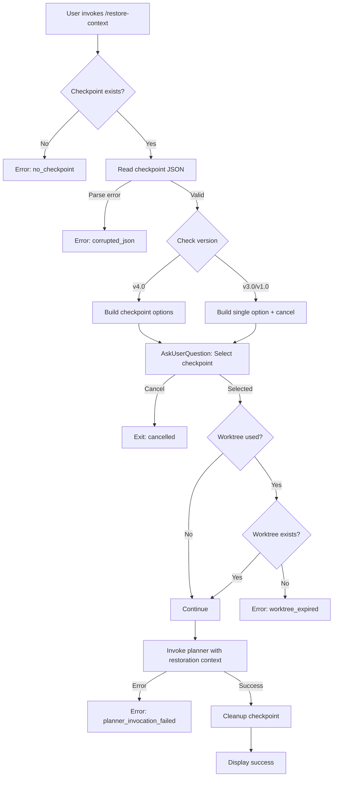

# Orchestration: Restoration Flow

## Purpose

Main decision tree and flow control for the restore-context skill.

## High-Level Flow



## Decision Points

### 1. Version Detection

```python
version = checkpoint_file.get("version", "1.0")

if version == "4.0":
    # Use processes/restore-v4.md
elif version == "3.0":
    # Use processes/restore-v3.md
else:
    # Use processes/restore-v1.md
```

### 2. Interactive Selection Required?

| Condition | Action |
|-----------|--------|
| v4.0 with multiple checkpoints | Interactive selection |
| v4.0 with single checkpoint | Selection + cancel option |
| v3.0/v1.0 | Selection + cancel option |

### 3. Worktree Verification Required?

| Condition | Action |
|-----------|--------|
| `worktree_path` is null/empty | Skip verification |
| `worktree_path` exists | Verify directory exists |

### 4. Agent Resume Available?

| Condition | Action |
|-----------|--------|
| `last_agent_id` present | Add `resume` parameter to Task |
| `last_agent_id` absent | Normal Task invocation |

## Module Invocation Order

1. **components/checkpoint-reader.md** → Read checkpoint file
2. **components/checkpoint-validator.md** → Validate schema
3. **rules/feature-interactive-selection.md** → User selection UI
4. **components/worktree-verifier.md** → Verify worktree (if used)
5. **processes/restore-v{1,3,4}.md** → Build restoration context
6. **rules/pattern-planner-invocation.md** → Invoke planner
7. **rules/feature-cleanup-after-restore.md** → Cleanup checkpoint

## Error Handling Strategy

All errors use centralized messages from **rules/pattern-error-messages.md**.

| Phase | Errors | Recovery |
|-------|--------|----------|
| Read | no_checkpoint, file_read_failed | Guide user to check/create |
| Parse | corrupted_json | Suggest jq validation |
| Validate | invalid_schema, empty_checkpoints | Suggest deletion |
| Selection | cancelled, invalid_slot | Graceful exit |
| Worktree | worktree_expired | Provide recovery commands |
| Invoke | planner_invocation_failed | Preserve checkpoint, retry |

## Exit Codes

| Code | Meaning |
|------|---------|
| `success` | Restoration complete |
| `cancelled` | User cancelled |
| `error` | Error occurred (see `reason` field) |
