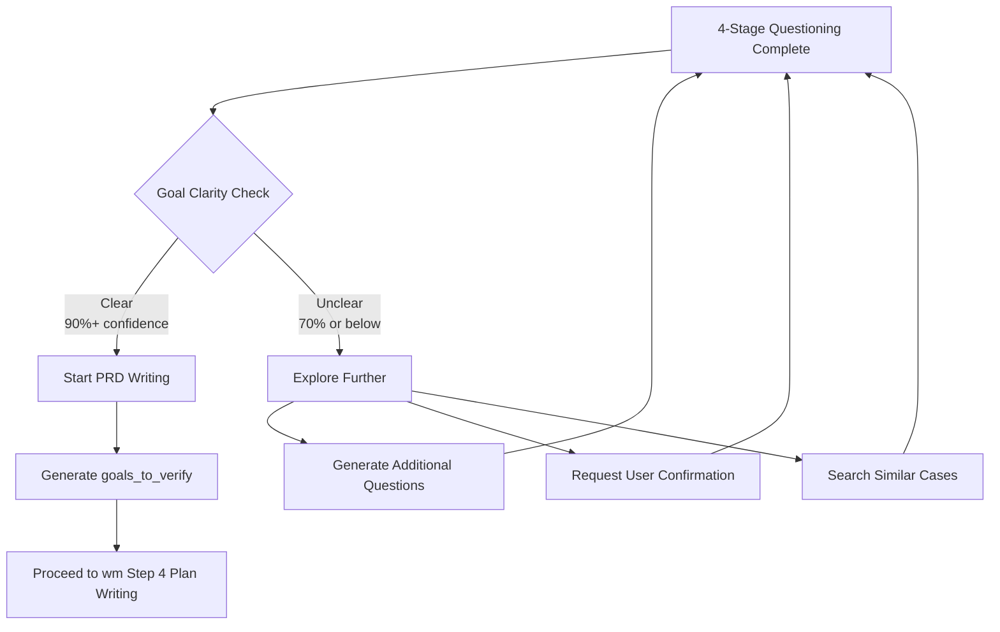

# Deep Questioning Guide

> **Version**: 1.0.0
> **Purpose**: Extract dreams, not just requirements
> **Author**: workflow-manager-plugin
> **Last Updated**: 2026-02-03

---

## Philosophy: Extract Dreams, Not Just Requirements

What users request is often just **surface-level requirements**. The goal of Deep Questioning is to uncover the **true goal (dream)**.

### Core Principles

| Principle | Description |
|-----------|-------------|
| **Listen for Dreams** | "Build a login feature" -> "I want to earn user trust" |
| **Question Assumptions** | "Why does it have to be this way?" -> Discover better alternatives |
| **Extract Goals, Not Tasks** | "Add a button" -> "Improve user convenience" |
| **Verify Understanding** | Confirm interpreted goals with the user |

---

## Application Scope

| Request Type | Apply Deep Questioning | Rationale |
|--------------|------------------------|-----------|
| **NEW_DEVELOPMENT** | ✅ Required | Goals unclear, exploration needed |
| **MODIFICATION** | ✅ Required | Need to understand change impact |
| **BUG_FIX** | ⚠️ Optional | Skip for simple bugs, apply for root cause analysis |
| **DOCUMENTATION** | ❌ Skip | Goals clear, overhead unnecessary |
| **CLEANUP** | ❌ Skip | Goal self-evident as technical debt removal |

---

## 4-Stage Questioning Framework

### Stage 1: WHAT

**Purpose**: Define concrete deliverables and success criteria

| Question | Example Answer |
|----------|----------------|
| What are the concrete deliverables? | "3 user authentication API endpoints" |
| How is completion defined? | "Login/logout/token refresh all pass tests" |
| What are the success criteria? | "Response time <200ms, success rate 99.9%" |
| In what form will it be delivered? | "REST API documentation + Postman Collection" |

**Output**: Populates `goals_to_verify[].criteria` field

---

### Stage 2: WHY

**Purpose**: Identify root reasons and business value

| Question | Example Answer |
|----------|----------------|
| What is the root reason this feature is needed? | "Need user identification for personalization services" |
| What problem is being solved? | "Anonymous users cannot save data" |
| What is the business value? | "Expected 20% MAU increase (login incentive)" |
| What happens without it? | "User churn rate increases" |

**Output**: Populates `goals_to_verify[].businessValue` field

---

### Stage 3: WHO

**Purpose**: Identify users and stakeholders

| Question | Example Answer |
|----------|----------------|
| Who are the primary users? | "Mobile app users (50K daily)" |
| Who are the stakeholders? | "Marketing team (email campaigns), CS team (account management)" |
| What is the usage context? | "Before first payment, or when saving cart" |
| What are the accessibility requirements? | "Social login required (Google, Kakao)" |

**Output**: Populates `goals_to_verify[].stakeholders` field

---

### Stage 4: DONE

**Purpose**: Identify priorities and dependencies

| Question | Example Answer |
|----------|----------------|
| What is the priority? | "P0 - Required for next release (2 weeks)" |
| What are the dependencies? | "User DB migration needed first" |
| What are the phased goals? | "Phase 1: Email login, Phase 2: Social" |
| What are the verification scenarios? | "100 user beta test -> Full rollout" |

**Output**: Populates `goals_to_verify[].priority`, `goals_to_verify[].dependencies` fields

---

## MODIFICATION-Specific Additional Questions

**Additional questions when Request Type is MODIFICATION**:

| Question | Purpose |
|----------|---------|
| **What changes?** | Specific targets being changed (files, functions, tables) |
| **Impact scope?** | Scope of affected systems/users |
| **Backward compatibility?** | Whether existing user/system compatibility is maintained |
| **Rollback plan?** | Rollback strategy in case of issues |

---

## Exploration Patterns

### 1. 5 Whys Technique

**When to use**: When goals are superficial

```
User: "Build a login page"
Agent: "Why is login needed?" (Why 1)
User: "We need to identify users"
Agent: "Why is identification needed?" (Why 2)
User: "To provide personalized recommendations"
Agent: "Why are recommendations important?" (Why 3)
User: "To increase purchase conversion rate"
Agent: "What is the target conversion rate?" (Why 4)
User: "From current 2% to 5%"
Agent: "What is the business impact of reaching 5%?" (Why 5)
User: "3x monthly revenue increase"

-> Real Goal: "Achieve 5% purchase conversion rate for 3x monthly revenue increase"
```

### 2. Goal Tree Expansion

**When to use**: When requirements are complex

```
Root Goal: "User Authentication System"
├─ Functional Goal: "Secure Login"
│  ├─ Sub-goal: "Password Encryption"
│  └─ Sub-goal: "2FA Support"
├─ Business Goal: "Build User Trust"
│  ├─ Sub-goal: "Privacy Protection"
│  └─ Sub-goal: "GDPR Compliance"
└─ UX Goal: "Convenient Access"
   ├─ Sub-goal: "Social Login"
   └─ Sub-goal: "Persistent Login"
```

### 3. User Story Mapping

**When to use**: When user experience is central

```
As a [user type]
I want [feature]
So that [goal]

Example:
As a "mobile shopping user"
I want "1-second login with Google account"
So that "I can quickly complete purchases"

-> Non-functional requirement: Login time <1 second
```

### 4. Constraint Discovery

**When to use**: When technical constraints are unclear

| Constraint Type | Questions |
|-----------------|-----------|
| **Technical** | Existing auth system? OAuth providers? |
| **Security** | Regulatory compliance? Encryption policy? |
| **Performance** | Concurrent logins? Response time SLA? |
| **Budget** | External service costs? Development resources? |

### 5. Negative Case Analysis

**When to use**: To discover edge cases

```
"What if login fails?"
"What if the email is a duplicate?"
"What if the token expires?"
"What if the server goes down?"

-> Derive error handling, retry logic, fallback scenarios
```

### 6. Success Scenario Walkthrough

**When to use**: To define verification criteria

```
1. User opens the app
2. Clicks "Continue with Google" button
3. Google auth popup (< 1 second)
4. Select account -> Approve permissions
5. Return to app -> Auto-login complete
6. Main screen displays "Welcome, [Name]"

-> Define success criteria and metrics for each step
```

---

## Decision Gate

Two paths after Deep Questioning completion:



**Clarity assessment criteria**:

| Checklist | Pass Criteria |
|-----------|---------------|
| Is WHAT specific? | ✅ Deliverables and success criteria defined |
| Does WHY connect to business value? | ✅ ROI or KPI mentioned |
| Is WHO clear? | ✅ User persona or metrics identified |
| Are DONE criteria measurable? | ✅ Priority and timeline defined |

**All 4 pass -> Clear (Start PRD writing)**
**Any 1 fails -> Unclear (Explore further)**

---

## Anti-patterns

### ❌ Anti-pattern 1: Overusing Yes/No Questions

```
Bad: "Do you need a login feature?" (-> Only gets "Yes")
Good: "Please explain specifically why login is needed"
```

### ❌ Anti-pattern 2: Proposing Technical Solutions First

```
Bad: "Would you like to use JWT?" (-> Confuses the user)
Good: "How would you like token expiration to be handled?" (-> Uncovers requirements)
```

### ❌ Anti-pattern 3: Asking Multiple Questions at Once

```
Bad: "What's the WHY, who's the WHO, and what's the priority?" (-> Overwhelming)
Good: Proceed through the 4 stages sequentially
```

### ❌ Anti-pattern 4: Ignoring User Responses

```
Bad: User said "just simple login" but planning OAuth 2.0
Good: Reconfirm user intent and start with minimum scope
```

### ❌ Anti-pattern 5: Questions Without Purpose

```
Bad: "What's the tech stack?" (-> Irrelevant information)
Good: "How should it integrate with existing systems?" (-> Related to HOW stage)
```

---

## Goal Extraction Template

Convert Deep Questioning results into structured data:

```json
{
  "goals_to_verify": [
    {
      "id": "GOAL-001",
      "description": "Implement user authentication feature",
      "stage": "WHAT",
      "criteria": "Login/logout success rate 99.9%+, response time <200ms",
      "priority": "HIGH",
      "businessValue": "20% MAU increase, 3x monthly revenue",
      "stakeholders": ["50K mobile app users", "Marketing team", "CS team"],
      "dependencies": ["User DB migration"],
      "successScenarios": [
        "Google login completes within 1 second",
        "Login state persists for 7 days"
      ]
    },
    {
      "id": "GOAL-002",
      "description": "GDPR Compliance",
      "stage": "WHY",
      "criteria": "Include privacy consent flow, delete data on account deletion",
      "priority": "MEDIUM",
      "businessValue": "Eliminate legal risk",
      "stakeholders": ["Legal team", "EU users"],
      "dependencies": ["GOAL-001"],
      "successScenarios": [
        "Confirm immediate data deletion upon consent withdrawal"
      ]
    }
  ]
}
```

---

## Integration with wm (Plan Writing)

**Reference**: wm SKILL.md Step 4

wm uses this guide during the Plan Writing stage as follows:

```python
# Step 0.5: Deep Questioning (wm Plan Writing)
Read(file_path=".claude/skills/wm/rules/policies/guide-deep-questioning.md")

# 1. Check application scope
if request_type in ["NEW_DEVELOPMENT", "MODIFICATION"]:
    # 2. Execute 4-Stage Questioning
    what_goals = ask_what_questions()
    why_goals = ask_why_questions()
    who_goals = ask_who_questions()
    done_goals = ask_done_questions()

    # 3. MODIFICATION-specific additional questions
    if request_type == "MODIFICATION":
        modification_details = ask_modification_questions()

    # 4. Decision gate
    clarity_score = calculate_clarity(what_goals, why_goals, who_goals, done_goals)

    if clarity_score >= 0.9:
        goals_to_verify = generate_goals(what_goals, why_goals, who_goals, done_goals)
        # Start PRD writing (proceed to Step 1)
    else:
        # Explore further (generate additional questions)
        continue_exploration()

# Step 1: Load Context (continue existing workflow)
```

---

## Changelog

| Version | Date | Changes |
|---------|------|---------|
| 1.0.0 | 2026-02-03 | Initial version - 4-stage framework, 6 exploration patterns |

---

**Next**: The `goals_to_verify` extracted using this guide are verified in the qa agent's Step 2.7 (Goal Achievement Verification).

**See Also**:
- `guide-artifact-verification.md` - Implementation result verification
- `guide-context-engineering.md` - Context optimization
- wm `SKILL.md` - Step 4 Plan Writing integration
